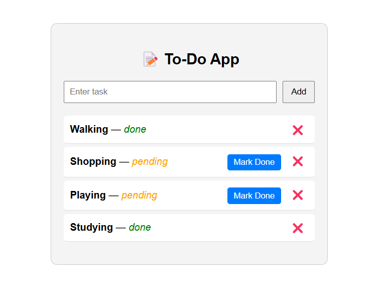

# 📝 To-Do App 

This is a simple full-stack To-Do application built with:
- 🚀 **Backend:** Spring Boot (Java)
- ⚛️ **Frontend:** React.js

---

## 📁 Project Structure

```
to-do-app/
├── to-do-app-backend/       # Spring Boot backend (REST API)
├── to-do-app-frontend/      # React frontend
└── README.md
```

---

## 🚀 Getting Started

### 🖥️ Backend Setup (Spring Boot)

1. Navigate to the backend folder:
   ```bash
   cd to-do-app-backend
   ```

2. Run the application (via IDE or terminal):
   ```bash
   ./mvnw spring-boot:run
   ```

3. The API will start on: `http://localhost:8080`

### 📦 API Endpoints

| Method | Endpoint              | Description                  |
|--------|-----------------------|------------------------------|
| GET    | `/task`               | Get all tasks                |
| GET    | `/task/{id}`          | Get task by ID               |
| POST   | `/task`               | Create a new task            |
| PUT    | `/task/{id}/{status}` | Update task status           |
| DELETE | `/task/{id}`          | Delete a task by ID          |

---

### 💻 Frontend Setup (React.js)

1. Navigate to the frontend folder:
   ```bash
   cd to-do-app-frontend
   ```

2. Install dependencies:
   ```bash
   npm install
   ```

3. Start the development server:
   ```bash
   npm start
   ```

4. The frontend will run on: `http://localhost:3000`

> Make sure the backend is running at `http://localhost:8080`. You may need to adjust proxy settings in `to-do-app-frontend/package.json`.

---

## 🔧 Features

- Add new tasks
- View all tasks
- Mark tasks as done
- Delete tasks
- Status cannot be reverted once marked done

---

## 📸 Screenshot

> 

---

## 🧠 Future Improvements

- Add edit task feature
- Add user authentication
- Filter tasks by status
- Responsive mobile design

---
